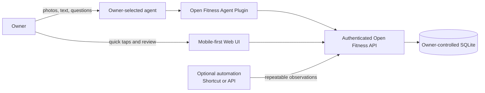
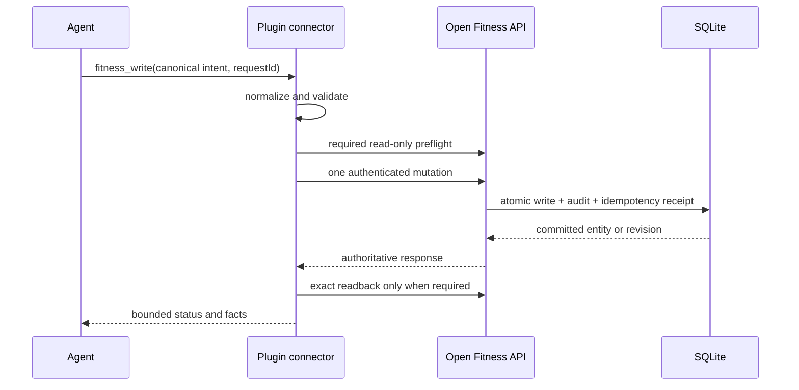
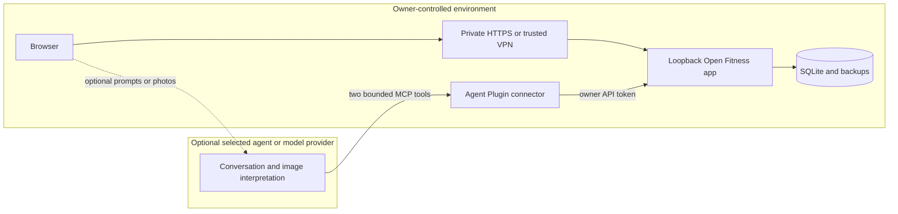
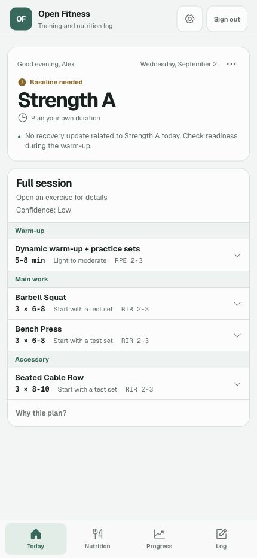
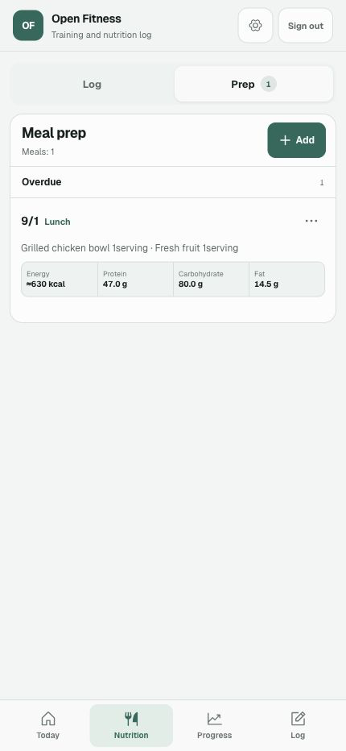

# How Open Fitness works

Open Fitness keeps one owner-controlled SQLite record while allowing each kind
of input to use the least-friction path. An agent is optional: the Web UI and
structured integrations use the same authenticated application boundary.

## Three input paths, one record

Use the Web UI when a tap is faster, an agent when the input needs
interpretation, and an automation for a supported repeatable update. The
SQLite database remains the canonical record.

## One verified write

The connector never guesses a second endpoint after a failed write. Repeating
the same request ID with the same canonical body resolves idempotently; changing
the body under the same ID conflicts.

## Privacy and trust boundary

The public package contains no owner data, token, certificate, database, or
host-specific deployment. If an external agent is used, the owner should review
that provider's retention and model-training terms and send only the data needed
for the task.

## Product views

The screenshots below are captured from the real Web UI backed by a disposable
database containing synthetic data only.

| Today | Nutrition |
| --- | --- |
|  |  |
